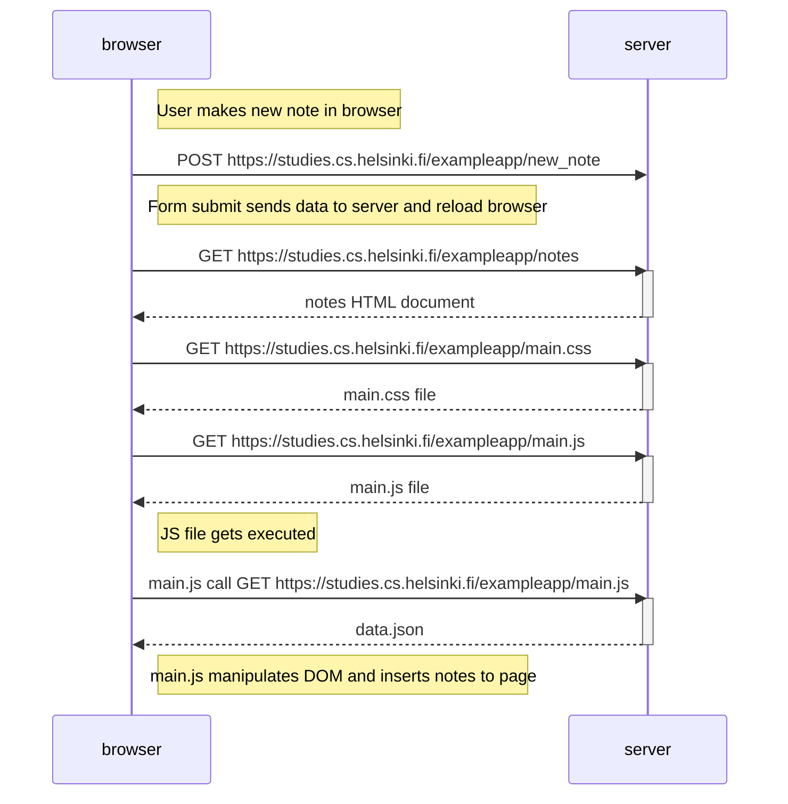

```mermaid
sequenceDiagram
    participant browser
    participant server

    Note right of browser: User makes new note in browser

    browser->>server: POST https://studies.cs.helsinki.fi/exampleapp/new_note
    
    Note right of browser: Form submit sends data to server and reload browser

    browser->>server: GET https://studies.cs.helsinki.fi/exampleapp/notes
    activate server
    server-->>browser: notes HTML document
    deactivate server

    browser->>server: GET https://studies.cs.helsinki.fi/exampleapp/main.css
    activate server
    server-->>browser: main.css file
    deactivate server
    
    browser->>server: GET https://studies.cs.helsinki.fi/exampleapp/main.js
    activate server
    server-->>browser: main.js file
    deactivate server

    Note right of browser: JS file gets executed

    browser->>server: main.js call GET https://studies.cs.helsinki.fi/exampleapp/main.js
    activate server
    server-->>browser: data.json
    deactivate server

    Note right of browser: main.js manipulates DOM and inserts notes to page
```
