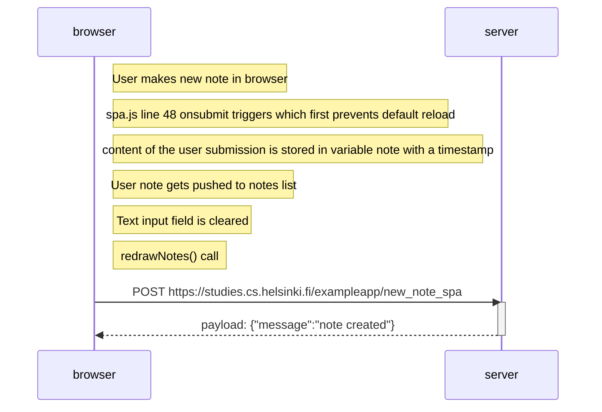

```mermaid
sequenceDiagram
    participant browser
    participant server

    Note right of browser: User makes new note in browser

    Note right of browser: spa.js line 48 onsubmit triggers which first prevents default reload

    Note right of browser: content of the user submission is stored in variable note with a timestamp

    Note right of browser: User note gets pushed to notes list

    Note right of browser: Text input field is cleared

    Note right of browser: redrawNotes() call

    browser->>server: POST https://studies.cs.helsinki.fi/exampleapp/new_note_spa
    activate server
    server-->>browser: payload: {"message":"note created"}
    deactivate server
```
